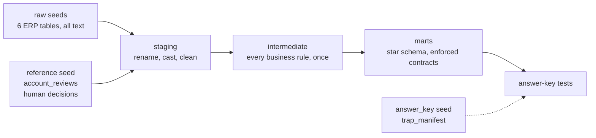

# legacy-erp-dbt

[](https://github.com/CosmicMass/legacy-erp-dbt/actions/workflows/ci.yml)

**A legacy ERP's undocumented stock-movement data, modeled into trustworthy marts, where every rule found in the raw data is enforced by an automated test.**

A fictional industrial-parts distributor sells bearings, seals and belts. It runs a legacy Turkish ERP, has two depots, sells to customers and dealers, and buys from suppliers in EUR, USD and TL. The ERP has no documentation. Its rules had to be reverse-engineered from the data, and each rule is a trap for naive SQL.

This project models that data with dbt and DuckDB. It plants 16 traps (T1–T16) and proves, with tests, that the models handle every one. The value is not the SQL. The value is that every finding becomes a test that runs on every build.

> **All data is synthetic.** Every company, brand, product code, account and price is invented by a deterministic generator.

## Quickstart

You need Python 3.12 and about a minute.

```bash
git clone https://github.com/CosmicMass/legacy-erp-dbt.git
cd legacy-erp-dbt
python -m venv .venv
source .venv/bin/activate        # Windows PowerShell: .venv\Scripts\Activate.ps1
python -m pip install -r requirements.txt
dbt build
```

Expected result:

```
Done. PASS=182 WARN=3 ERROR=0
```

The 3 warnings are on purpose. They are data-quality monitors that report known problems in the ERP data on every run (see [Testing](#testing)).

There is no setup beyond that. `profiles.yml` is in the repo, and DuckDB is a single local file with no server.

To browse the models, the lineage graph and every test:

```bash
dbt docs generate
dbt docs serve
```

Every CI run also uploads the docs as one self-contained `static_index.html` that opens without a server.

## Architecture



| Layer | Schema | Job | Models |
|---|---|---|---|
| Seeds | `raw`, `reference`, `answer_key` | The ERP export exactly as exported, every column as text. A reviewed list of account decisions. The generator's answer key. | 8 seeds |
| Staging | `staging` | Rename, cast, clean, decode single codes. Changes the format, never the meaning. One model per table, no joins. | 7 views |
| Intermediate | `intermediate` | Every business rule, written once: movement flows, account classes, latest cost, currency evidence, stock and invoice reconciliation. | 6 views |
| Marts | `marts` | The public interface: `dim_products`, `dim_accounts`, `fct_sales`, `fct_stock_positions`, `fct_sale_invoices`. | 5 tables |

The answer key feeds tests only. A test ([`no_model_reads_the_answer_key`](tests/invariants/no_model_reads_the_answer_key.sql)) fails the build if any model reads it.

### The dataset

| Seed | ERP-style source | Rows |
|---|---|---|
| `raw_tblsthar` | Stock movements, one row per document line, one fiscal year | 22,480 |
| `raw_tblstsabit` | Product master | 600 |
| `raw_tblcasabit` | Chart of accounts | 228 |
| `raw_tblcahar` | Account ledger, sale invoices | 3,445 |
| `raw_vw_stok_bakiye` | Balance view, stock per product | 555 |
| `raw_vw_depo_bakiye` | Depot balance, one column per depot | 570 |
| `account_reviews` | Analyst decisions on accounts the data cannot classify | 10 |
| `trap_manifest` | The answer key: every planted case and its expected result | 2,231 |

Raw column names keep the ERP's cryptic style (`STHAR_HTUR`, `STOK_KODU`). Staging renames them to clear English (`movement_type`, `product_code`), so the reverse-engineering stays visible.

## The trap map

Each row is a rule found in the raw data. The **invariant** holds on any data and would also run in production. The **answer-key test** proves that the models find exactly the planted cases.

| Trap | Naive SQL gets it wrong because… | How the models handle it | Invariant | Answer-key test |
|---|---|---|---|---|
| **T1** Open sales are never invoiced | Counting only invoices (`J`) loses real revenue. | `flow = open_sale` (H + outbound on a real account). `fct_sales` holds invoices and open sales. | [H and J never share a document](tests/invariants/t01_no_document_is_both_open_sale_and_invoice.sql) | [`t01`](tests/answer_key/t01_open_sales.sql) |
| **T2** No usable cost column | The cost-named columns are 0 on every row. | Staging drops them. The cost is the unit price on a purchase row. | Seed tests: both columns are always 0 | [`t02`](tests/answer_key/t02_zero_cost_columns.sql) |
| **T3** Latest cost needs a priority | Ranking by date lets a return win. | Purchase first, then opening row, then date, then insert key. Returns are never a cost. | `cost_source` is purchase or opening | [`t03`](tests/answer_key/t03_latest_cost_priority.sql) |
| **T4** Same-date ties | "Latest" changes between runs. | The insert key breaks ties: the row entered last wins. | One cost per product | [`t04`](tests/answer_key/t04_same_date_tie.sql) |
| **T5** An inbound code that looks like a cost | A customer adjustment price is taken as a cost. | Kept in a separate reference column, never a cost. | `cost_source` is purchase or opening | [`t05`](tests/answer_key/t05_customer_adjustments.sql) |
| **T6** Dealers are not end customers | Channels are mixed in one "sales" figure. | `sales_channel`: `end_customer`, `collector`, `dealer`. Bidirectional partners are flagged. | — | [`t06`](tests/answer_key/t06_sales_by_account_class.sql) |
| **T7** Internal accounts hide under `120-` | `LIKE '120-%'` reports stock adjustments as customer sales. | A structural signal finds candidates; a human review ([`account_reviews`](seeds/reference/account_reviews.csv)) decides. | [Every candidate is reviewed](models/intermediate/_intermediate__models.yml) | [`t07`](tests/answer_key/t07_internal_accounts.sql) |
| **T8** Collector accounts are real sales | Excluding walk-in buyers drops revenue. | Class `collector`: kept in revenue, flagged as anonymous. | — | [`t08`](tests/answer_key/t08_collector_accounts.sql) |
| **T9** Dealer returns go both ways | Purchase returns are netted against sales. | `dealer_return` reverses a sale; `purchase_return` is purchasing and stays out of `fct_sales`. | `fct_sales` flows | [`t09`](tests/answer_key/t09_dealer_returns.sql) |
| **T10** The balance view misses products | `COALESCE(balance, 0)` hides them as zero stock. | Anchored on the product master, no `COALESCE`. Absent and zero are different statuses. | [Every product has a stock row](models/marts/_marts__models.yml) · monitor | [`t10`](tests/answer_key/t10_missing_from_balance_view.sql) |
| **T11** No stock source is the truth | One source is picked as the winner. | Three figures side by side: balance view, depot source, movement ledger. The status says which one differs. | Monitor | [`t11`](tests/answer_key/t11_stock_source_disagreements.sql) |
| **T12** A depot the depot source doesn't know | Depot 3 stock looks like a disagreement. | The known depots are read from the data, not hardcoded. Untracked stock gets its own column. | Movement depots are known codes | [`t12`](tests/answer_key/t12_third_depot.sql) |
| **T13** The currency flag can lie | The master's flag is trusted. | The currency the brand actually trades in, taken from the movements. | One currency per brand · monitor | [`t13`](tests/answer_key/t13_currency_flags.sql) |
| **T14** Prices are per unit, VAT-excluded | Invoices are recomputed at the wrong grain or without VAT. | Each invoice is recomputed from its lines and matches the ledger to the cent. | [Every invoice reconciles](models/marts/_marts__models.yml) | [`t14`](tests/answer_key/t14_ledger_reconciliation.sql) |
| **T15** Dirty codes, near-duplicates | Joins miss dirty codes; a shared base code merges products. | [`clean_product_code`](macros/clean_product_code.sql) builds the join key. `base_code` is for similarity only. | [No dirt survives cleaning](models/staging/erp/_erp__models.yml) · unique codes | [`t15`](tests/answer_key/t15_product_codes.sql) |
| **T16** Stored vs displayed precision | Totals are recomputed from 2-decimal screen prices. | The display-based total sits next to the real one, with a gap flag. | — | [`t16`](tests/answer_key/t16_display_precision.sql) |

## Testing

`dbt build` runs 159 tests of four kinds:

- **Structural tests** on every layer: keys, accepted codes and relationships. An unknown ERP code decodes to `NULL`, and a `not_null` test fails loudly.
- **Invariants** hold on any data, synthetic or real, and never read the answer key. Example: every structural candidate for an internal account must have a human review. When a new internal account appears next year, the build fails until someone reviews it.
- **Answer-key tests**, one per trap in [`tests/answer_key/`](tests/answer_key/), compare the models with the answer key **in both directions**:
  - **Recall:** every planted case is found.
  - **Precision:** nothing else is flagged. A model that flagged all 600 products would still fail.
- **Monitors** with `severity: warn` report the ERP's known data problems on every run without failing the build: 15 products missing from the balance view (T10), 21 stock disagreements (T11) and 43 wrong currency flags (T13). They are the data-quality report.

The answer-key tests only make sense on synthetic data, so they carry the tag `answer_key`:

```bash
dbt build --exclude tag:answer_key    # a production run: PASS=166 WARN=3
dbt test --select tag:answer_key      # the 16 answer-key tests only
```

Every mart has an **enforced model contract**. The build fails if a column's real type differs from the declared one, including the decimal precision. So a change that silently turns money into `DOUBLE` never reaches a table.

### Testing the tests

A test that never fails proves nothing. So each trap was checked by building a deliberately naive version of the model and confirming that the right test fails:

| Naive change | Caught by |
|---|---|
| `fct_sales` keeps invoices only (T1) | `t01`, `t06`, `t08` |
| Latest cost = latest inbound price, by date only (T3) | `cost_source` accepted values; `t03`, `t04`, `t05` |
| Tie broken by the lower insert key (T4) | `t04` (all 25 products) |
| Accounts classified by prefix only (T7) | `t07`, `t08`, `t06`, `t01` |
| A candidate's review row deleted (T7) | The invariant; the build skips 93 downstream nodes |
| Purchase returns counted as sale returns (T9) | `t09` and 3 structural tests |
| `COALESCE(balance, 0)` (T10) | `t10`, `t11` |
| Depot 3 ignored in the comparison (T11, T12) | `t11`, `t12` |
| The master's currency flag trusted (T13) | `t13` |
| Each line rounded before summing (T14) | The invariant (1,007 invoices off by cents), `t14`, `t16` |
| Mojibake left in the codes (T15) | The invariant, `t15` |
| Display total from full-precision prices (T16) | `t16` |
| A model that reads the answer key | `no_model_reads_the_answer_key` |

The `COALESCE(balance, 0)` and "trust the master" versions show something important. They did not just produce wrong numbers; they also **silenced their own monitor**. The build showed one warning fewer and looked cleaner than before. Monitors watch the data but trust the model's logic. The answer-key tests check the logic, and they caught both.

## Design decisions

- **Raw seeds load every column as text.** Trailing spaces, non-breaking spaces and 8-decimal prices survive the load exactly as exported. Staging casts the types.
- **A currency mapping per table.** The same code means a different currency in different tables (T13), so each table has its own mapping in `dbt_project.yml`. An unknown code becomes `NULL` and fails a test.
- **A human in the loop for accounts.** The structural signal for internal accounts also flags two real customers. A pure rule would drop their revenue. So a small reviewed seed records the decision, and a test makes sure the review stays complete.
- **The movement ledger as a third stock figure.** Summing signed movement quantities explains every disagreement between the two stock sources, without picking a winner.
- **One model knows the ERP codes.** [`int_stock_movements_classified`](models/intermediate/int_stock_movements_classified.sql) turns code combinations into a `flow`. Every later model uses `flow`. An unknown combination becomes `NULL` and fails a test.
- **A star schema for the marts.** Wide dimensions, narrow facts. Each attribute lives in one place, so a fix reaches every fact through the join.
- **Two DuckDB decimal traps, handled:**
  - Every `/` returns `DOUBLE`, even between decimals. The VAT factor is built by multiplication (`1 + rate * 0.01`), so money stays `DECIMAL`.
  - `DECIMAL(18,4) × DECIMAL(18,8)` is typed `DECIMAL(18,12)` and overflows at 1,000,000. The quantity is widened before multiplying.
- **Invoice headers are grouped, not aggregated.** If an invoice's lines ever disagree on account, date, currency or VAT rate, the invoice gets two rows and a `unique` test fails. `min(account_code)` would have hidden it.
- **No packages.** The two generic tests the project needs ([`expression_is_true`](tests/generic/expression_is_true.sql), [`unique_combination`](tests/generic/unique_combination.sql)) are written in the repo.

## Project layout

```
generator/          synthetic data generator (python -m generator)
seeds/              raw ERP tables, trap_manifest (answer key)
  reference/        account_reviews: human decisions
models/
  staging/          rename, cast, clean
  intermediate/     business rules
  marts/            dimensions and facts, with contracts
macros/             code cleaning, currency decoding, test helpers
tests/
  generic/          custom generic tests
  invariants/       rules that hold on any data
  answer_key/       one test per trap, T1 to T16
.github/workflows/  CI
```

## The synthetic data generator

`python -m generator` builds the whole dataset in about 3 seconds:
- It builds a clean world first, then plants each trap in a known quantity.
- It self-checks every count, and writes the CSVs and the answer key only if all checks pass.
- It is deterministic: a fixed seed gives byte-identical CSVs on every run. CI proves this on every push by regenerating the seeds and failing if a single byte changed.

The generated CSVs are committed, so running the generator is never required to build the project.

## CI

On every push and pull request, [GitHub Actions](.github/workflows/ci.yml) runs on a clean machine:

1. Installs the pinned dependencies.
2. Regenerates the seeds and fails on any difference (`git diff --exit-code`).
3. Runs `dbt build`: every model, contract and test, the answer-key tests included.
4. Builds the dbt docs as one static page and uploads it as an artifact.

## Not in v1

- **Dashboards or BI, orchestration, incremental models, snapshots:** out of scope, to keep v1 small and fully tested.
- **Currency conversion:** there is no exchange-rate table. Amounts stay in their document currency, and the docs say never to sum across currencies.
- **Margins and stock valuation:** the latest cost is not the cost at the time of sale, and valuing stock would force a winner among the stock sources, which T11 forbids.

## License

[MIT](LICENSE)
